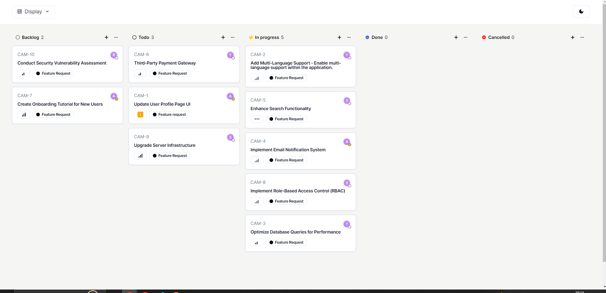
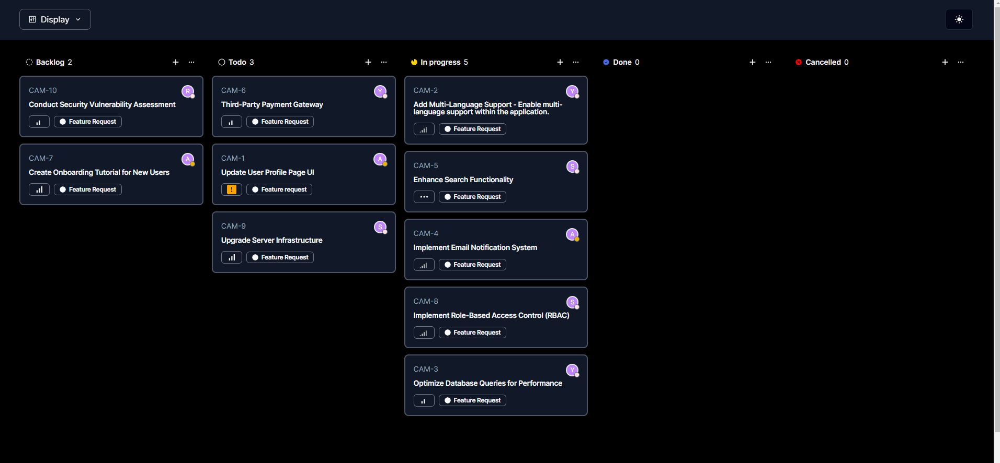

# Kanban Board Application

## Overview

This React application implements an interactive Kanban board that fetches data from a provided API and allows users to dynamically group and sort tickets based on various options. The application provides a visually appealing and responsive interface for managing tasks.




## Live Demo

[live](https://kanban-board-git-main-atif-27s-projects.vercel.app/)

## Features

- **Grouping Options:** Group tickets by status, user, or priority.
- **Sorting Options:** Sort tickets by priority or title.
- **Dark Mode:** Toggle between light and dark mode for improved user experience.
- **Persistence:** User's view state is saved even after a page reload.

## Getting Started

First, Install dependencies

```bash
npm i
```

Start the development server

```bash
npm run dev
```

Open [http://localhost:3000](http://localhost:3000) with your browser to see the result.
